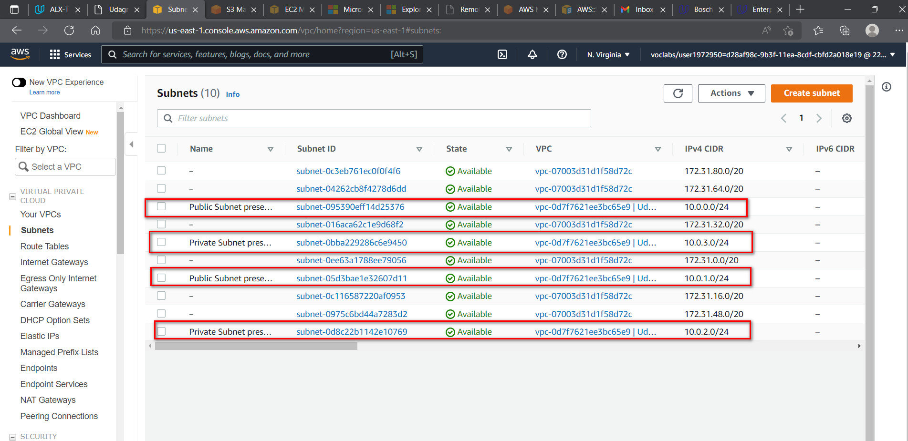
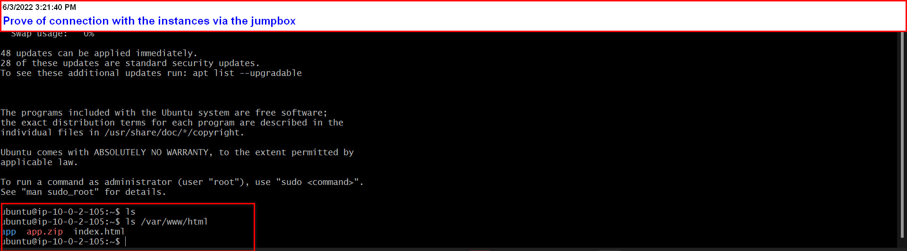

## Deploying a Highly Available Instagram Like Application Using Cloud Formation (UDAGRAM)

This project leverages the use of AWS CloudFormation which is an Infrastructure as Code(IAC) tool used in automated creation and provisioning of resources.

Below represents the project architecture to be set up

The code in this repository was structured to create all resources required in this project and to foster better code readability. Infrastructures were created in two batches popularly known as STACKS. This includes the:
1. Network Stack
2. Server Stack

The network stack consists of:
- Virtual Private Cloud VPC
- NAT Gateway
- Elastic IP address tied to the NAT
- Internet Gateway
- Routes and Route Tables
- Private and Public Subnets

The Server stack consists of:
- Elastic Cloud Instances (Web and Bastion Host Servers)
- Launch Configurations
- AutoScaling Group
- Target Group
- LoadBalancers
- IAM Roles and Policies

## Looking Closely Into The Created Resources
<b>S3 BUCKET</b>: The global S3 bucket was created and it contain the application file which gets uploaded by the administrator then as defined in the autocreation template gets downloaded into the instances 

<b>Server Resources</b>:

- The EC2 Instances are automatically spun up as defined in the AutoScaling LaunchConfiguration

- The NAT Gateway created in the public subnets ensures that the instances in our private can access the internet via an Internet Gateway

- The LoadBalancer routes traffic from users to the various EC2 instances scaled up/down by the AutoScaling Group. All instances are in the target group.

<b>Network Resources</b>:
- The VPC serves as the virtual network for our application

- The Public subnets contains a public ipv4 address and it houses the NAT Gateway,Loadbalancers and the bastion host. Its public facing is useful for coneection with the internet via the internet gateway. The Private Subnets is were our EC2 instances are created and it provides an isolation to the instances for security purposes.

- Internet Gateway serves as the pathway for access to the internet

- Public and Private Route Tables ensures that traffic are routed properly inside the network and the right traffic gets to the right destination.

## Administrator Access Via JumpBoxServer (Bastion Host)
From the project architecture, we see that our instances are located in the private subnets which ensures that the EC2 instances are inaccessible by anyone in the outside world. For the admininstrator to gain access to this servers for maintenance and admininstrative purposes, it is vital that a dedicated server is created to access these instances by the administrator.

The jumpbox server connects to the instances via local ipv4 address as they exist within the same virtual network and so no public internet network connection is required.

- Connecting to Jumpbox instance

- Uploading Private Server Key to instance

- Connection Success

- Proof of Connection

## AWS CloudWatch For Resource Monitoring
A cloudwatch resource was created to help monitor the performances of resources present in our network

